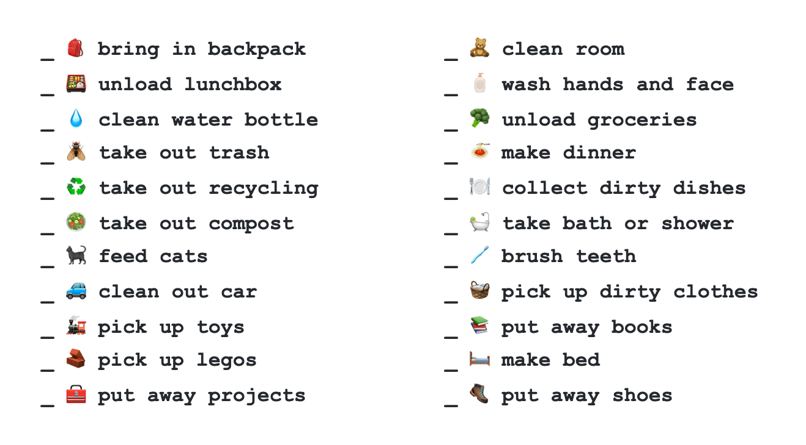
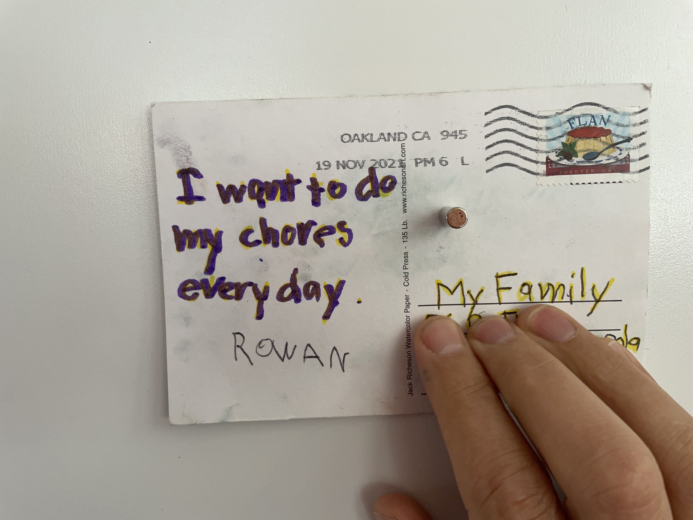
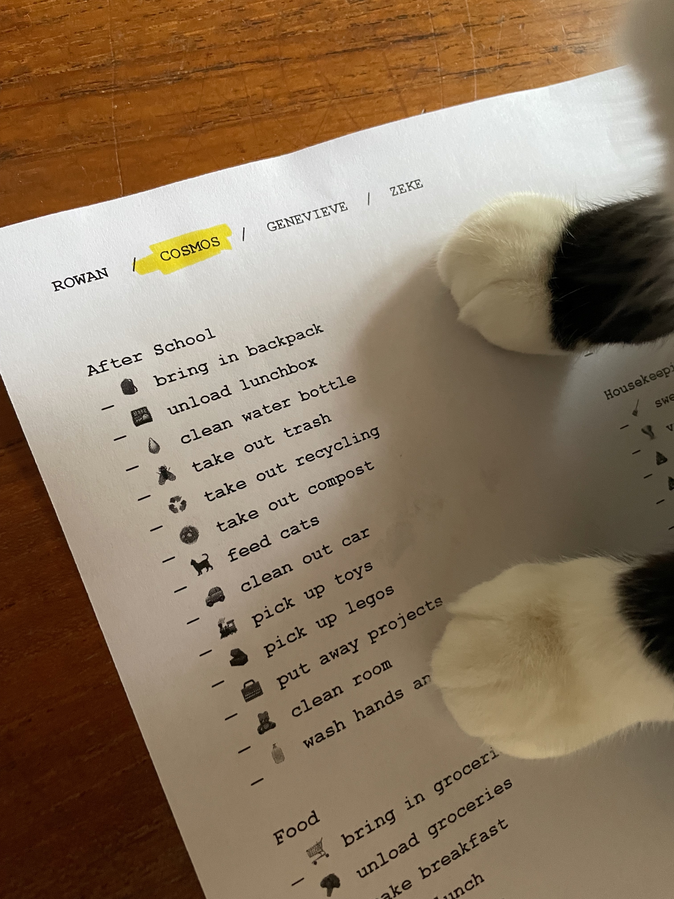

# Kid Chores

A bespoke open-source monospaced emoji chore list for kids. 🆒

---

---

## What you'll need

- 🐵 one or more kids
- 🦄 an imagination
- 💻 a computer
- 🖨 a printer
- 💅 a highlighter
- ✏️ a pen or pencil

## Instructions

1. 📄 [Open the list](https://docs.google.com/document/d/1uxTckWcYVPEFbnqvfsjukzmV2J2GsxhLlk-tU3kVB30/edit?usp=sharing) on Google Docs and save your own copy.
1. 📣 Gather your kid(s) for a brainstorm.
1. 🤔 Enumerate your family's daily chores, using the existing list as a starting point.
1. 💩 Choose an emoji to go with each chore. Including kids in this step is crucial! It's also useful for younger kids who aren't reading words yet. Including them in this process will help them form associations and remember the chores.
1. 📃 Once you've got your first draft list together, print a few copies of the list.
1. 🌈 Use one sheet each day. Highlight the chores that need to be done.
1. 🤝 Review the highlighted chores together and agree on them.
1. 🐎 Turn them loose! Let them check off each chore as they're finished.
1. 🔁 Refine your list when you think of new chores or realize some of your listed chores aren't relevant.

## Proof

